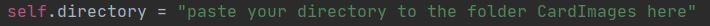
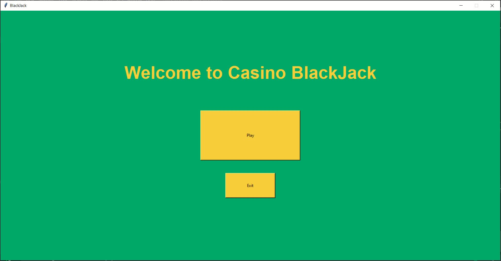
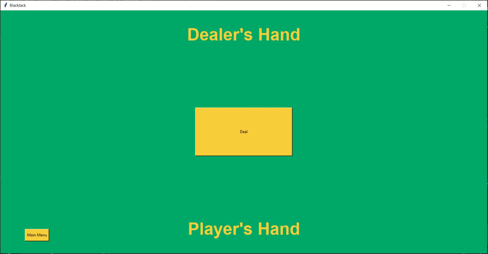
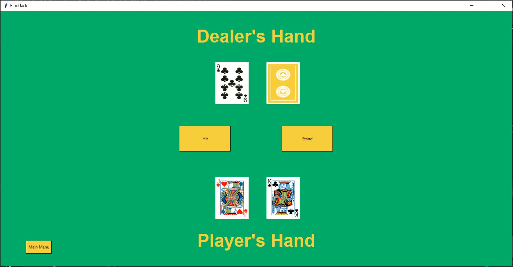
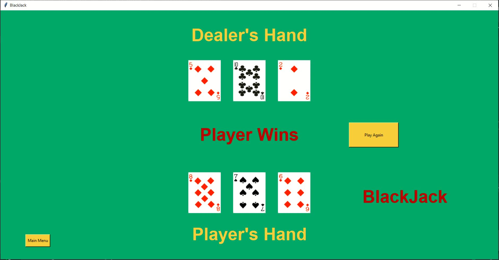

# GUI Blackjack
This is a GUI Blackjack game. It is a simplified virsion of casino Blackjack. It allows one player to go head to head against the dealer. The game does not have betting functionality or hand splitting functionality when the player is dealt two of the same numbered cards. 

# What I Learnt
1- Worked with tkinter to build GUI application. 
2- Used object oriented programming. 
3- Used Pillow library to manage images.

# User Instructions
1- Save all contents of the folder "GUI Black Jack" on your computer in the same folder. 

2- Open "Black Jack GUI.py" and scroll down till you find the variable "self.directory", the variable is on line 47. Copy the directory to the folder CardImages contained inside the "Black Jack GUI" folder and paste it into "self.directory". Seperate folders in your directory path with "/". This step is so that the script has access to the images used by the GUI.

3- Run "Black Jack GUI.py". The GUI window will open and display as shown below. 

4- To start playing click play and you will be brought to the table, as shown below! 

5- Enjoy the game!

# GUI Pictures
1- Hitting

2- Blackjack

